# GitHub Actions: Zero to Advanced

> Go from *"I've never written a line of YAML"* to *building real, multi-job CI pipelines* with GitHub Actions — all from the browser, no local setup required.

This is the teaching script **and** the self-study guide for the video series (channel **LearnWithMithran**). Every concept below has:

1. **What it is** — a plain-English explanation of the keyword.
2. **A tiny example** — a small, focused YAML file you can copy-paste and run.
3. **What to observe** — what you should see in the **Actions** tab.

Everything is taught against the **current (2026) GitHub Actions platform** — current action versions (`actions/checkout@v5`, `actions/setup-node@v6`), and least-privilege defaults.

---

## 📚 Table of Contents

**Getting started**

- [How to use this course (browser-only)](#how-to-use-this-course-browser-only)

**Day 1 — Foundations**

1. [What is CI/CD and where does GitHub Actions fit?](#1--what-is-cicd-and-where-does-github-actions-fit)
2. [YAML in 10 minutes](#2--yaml-in-10-minutes)
3. [Anatomy of a workflow](#3--anatomy-of-a-workflow)
4. [Triggers — the `on` keyword](#4--triggers--the-on-keyword)
5. [Runners — the `runs-on` keyword](#5--runners--the-runs-on-keyword)
6. [Steps: `run` vs `uses`](#6--steps-run-vs-uses)
7. [Marketplace actions: checkout & setup-node](#7--marketplace-actions-checkout--setup-node)

**Day 2 — From one job to a real pipeline**

8. [Environment variables & scopes](#8--environment-variables--scopes)
9. [Contexts & expressions](#9--contexts--expressions)
10. [Secrets & variables](#10--secrets--variables)
11. [🚀 Your first CI pipeline (capstone)](#11---your-first-ci-pipeline-capstone)
12. [Many jobs run in parallel](#12--many-jobs-run-in-parallel)
13. [`needs` — building a pipeline](#13--needs--building-a-pipeline)
14. [`if` — conditional jobs and steps](#14--if--conditional-jobs-and-steps)
15. [Status functions](#15--status-functions)

**Reference**

- [Cheat sheet](#-cheat-sheet)
- [Reference links](#-reference-links)
- [Coming up next](#-coming-up-next)

---

## How to use this course (browser-only)

You do **not** need to install anything. We work entirely in the GitHub website.

### One-time setup

1. Sign in to [github.com](https://github.com).
2. Click **New repository** → name it `github-actions-practice` → check **Add a README** → **Create repository**.

### The loop we repeat throughout

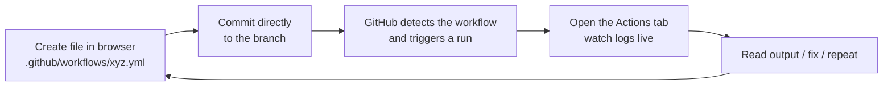

**To add a workflow file in the browser:**

1. Click **Add file → Create new file**.
2. In the filename box, type: `.github/workflows/01-hello-world.yml`
   - ⚠️ The folder path **must** be exactly `.github/workflows/`. GitHub only looks there.
3. Paste the YAML content.
4. Scroll down → **Commit changes** (commit directly to `main` for practice).
5. Click the **Actions** tab to watch it run.

> 💡 **Where the files live in this repo:** the copy-paste YAML files are numbered in teaching order — Day 1 topics in [`day-01/workflows/`](day-01/workflows/) (`01`–`11`) and Day 2 topics in [`day-02/workflows/`](day-02/workflows/) (`12`–`19`). The sample app is in [`sample-app/`](sample-app/) at the repo root.
>
> 📦 **Everything is prebuilt — nothing to generate.** Clone or download this repo and you get every workflow file plus a complete, ready-to-run sample app, `package-lock.json` included. There is no setup step, no `npm install` on your machine, and no lockfile to create. Copy, commit, watch it run.

---

# Day 1 — Foundations

**Goal:** demystify CI/CD, get comfortable with YAML and workflow anatomy, and understand the core keywords — triggers, runners, `run`/`uses`, and Marketplace actions.

## 1 — What is CI/CD and where does GitHub Actions fit?

**CI — Continuous Integration:** every time a developer pushes code, it is automatically **built, linted, and tested**. Bugs are caught in minutes, not weeks.

**CD — Continuous Delivery/Deployment:** after tests pass, the code is automatically **packaged and shipped** to a server, app store, or cloud.

Without automation, every developer has to *remember* to test and deploy manually. That doesn't scale and humans forget. CI/CD makes it automatic and repeatable.

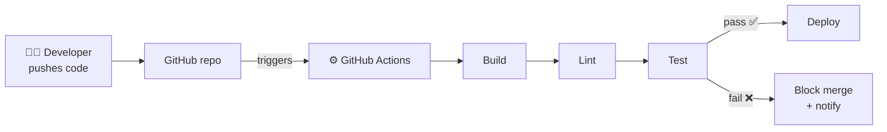

**GitHub Actions** is GitHub's **built-in automation engine**. It lives inside your repository — no separate server like Jenkins to maintain. You describe *what should happen and when* in a YAML file, and GitHub runs it on a machine it provides for free (within limits).

**The mental model — remember these 5 words:**

| Term | Meaning |
|------|---------|
| **Event** | Something that happens (a push, a PR, a schedule, a button click). |
| **Workflow** | The automated process, defined in a `.yml` file, that runs when an event fires. |
| **Job** | A group of steps that run together on one runner. A workflow can have many jobs. |
| **Step** | A single task: either a shell command (`run`) or a reusable action (`uses`). |
| **Runner** | The virtual machine that executes a job. |

> **Pricing note:** GitHub Actions is **free for public repositories**. Private repos get a monthly free allotment of minutes/storage, then pay-as-you-go. See [About billing for Actions](https://docs.github.com/en/billing/managing-billing-for-github-actions/about-billing-for-github-actions).

---

## 2 — YAML in 10 minutes

Workflow files are written in **YAML** (`.yml` or `.yaml`). YAML is just a way to write structured data that's easy for humans to read. You only need a handful of rules:

```yaml
# 1. Comments start with a hash.

# 2. Key-value pairs use a colon + space:
name: My Workflow

# 3. INDENTATION defines structure. Use SPACES, never TABs.
#    (2 spaces per level is the convention.)
jobs:
  build:
    runs-on: ubuntu-latest

# 4. A list (sequence) uses dashes:
branches:
  - main
  - develop
# ...or inline (flow) style:
branches: [main, develop]

# 5. A map (object) is a set of key-values:
with:
  node-version: '20'
  cache: 'npm'

# 6. Multi-line strings:
run: |          # the "|" keeps line breaks (each line runs)
  echo "line 1"
  echo "line 2"
```

**The #1 beginner mistake:** wrong indentation, or using a **TAB** instead of spaces. YAML will reject tabs. When in doubt, count your spaces.

> 🧰 **Validate before you commit:** paste your YAML into [yamllint.com](http://www.yamllint.com/) or the [GitHub Actions VS Code extension](https://marketplace.visualstudio.com/items?itemName=github.vscode-github-actions) to catch indentation errors early.

---

## 3 — Anatomy of a workflow

Every workflow follows the same shape. Here is the hierarchy:

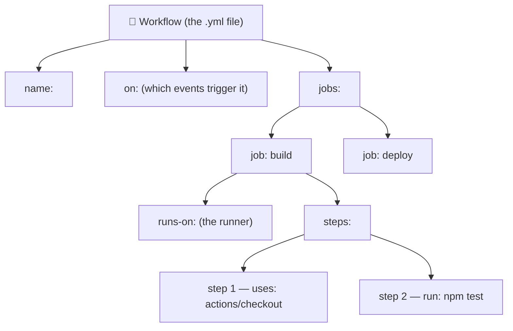

**How a run actually executes:**

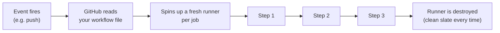

**Key facts to internalize:**

- Jobs run **in parallel** by default (unless you connect them — section 13).
- Steps within a job run **in order, top to bottom**.
- Each job gets a **brand-new, clean runner**. Nothing carries over between jobs unless you explicitly pass it.
- If any step fails, the remaining steps are **skipped** and the job is marked failed (by default).

### ▶️ Example — [`01-hello-world.yml`](day-01/workflows/01-hello-world.yml)

The smallest possible workflow. It has one job, `say-hello`, with two steps.

**Do this now:**

1. Create `.github/workflows/01-hello-world.yml` in the browser, paste the file.
2. Go to **Actions → 01 - Hello World → Run workflow** (because it uses `workflow_dispatch`).
3. Click into the run and read the log of each step.

**What to observe:** the two steps run in order; the second step reads built-in variables like `$RUNNER_OS`.

---

## 4 — Triggers — the `on` keyword

`on:` decides **when** your workflow runs. This is the single most important keyword to master. Below are the events you'll use daily.

### 4.1 `push` — [`02-on-push.yml`](day-01/workflows/02-on-push.yml)

Runs on every push. The classic "test my code as soon as it changes" trigger.

### 4.2 `pull_request` — [`03-on-pull-request.yml`](day-01/workflows/03-on-pull-request.yml)

Runs when a PR is opened or updated. This is how you gate code **before** it merges. Try it: create a new branch in the browser, edit a file, and open a PR — watch the workflow run on the PR.

### 4.3 Filters: branches & paths — [`04-on-branches-paths.yml`](day-01/workflows/04-on-branches-paths.yml)

Only run when it matters — e.g., only on `main`, or only when files under `sample-app/` change. Saves minutes and noise.

> ⚠️ **`paths` are matched from the repo root.** Since our app sits in `sample-app/`, the filter has to say `sample-app/**`. Writing `src/**` would match nothing and the workflow would silently never run — a genuinely confusing bug to chase.
>
> ⚠️ Use **either** `branches` **or** `branches-ignore`, never both. Same for `paths`/`paths-ignore`.

### 4.4 `workflow_dispatch` — [`05-on-workflow-dispatch.yml`](day-01/workflows/05-on-workflow-dispatch.yml)

Adds a manual **"Run workflow"** button, optionally with **inputs** (dropdowns, text, checkboxes). Perfect for deployments and one-off tasks.

### 4.5 `schedule` (cron) — [`06-on-schedule.yml`](day-01/workflows/06-on-schedule.yml)

Run on a timer — nightly builds, health checks, cleanups. **Times are in UTC.** Build cron expressions with [crontab.guru](https://crontab.guru).

### 4.6 Combine them — [`07-on-multiple-events.yml`](day-01/workflows/07-on-multiple-events.yml)

Real workflows listen to several events at once: push to `main` + every PR + a manual button. This is the standard CI setup.

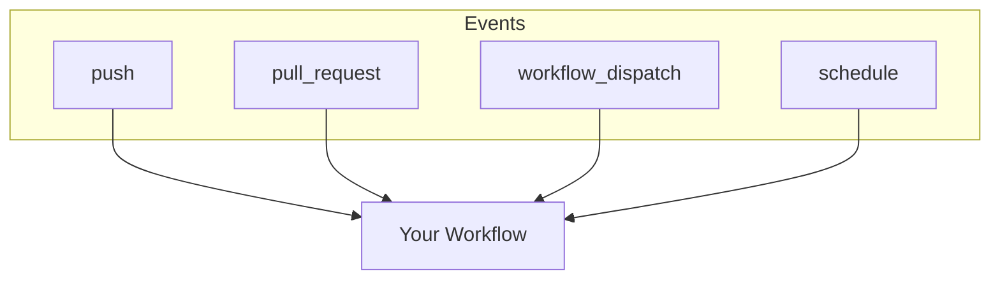

> 📖 Full event list: [Events that trigger workflows](https://docs.github.com/en/actions/reference/events-that-trigger-workflows).

---

## 5 — Runners — the `runs-on` keyword

A **runner** is the virtual machine that executes your job. GitHub hosts fresh runners for you: **Linux, Windows, and macOS**, each pre-loaded with common tools (Git, Node, Python, Docker, etc.).

### ▶️ Example — [`08-runs-on-and-runner-context.yml`](day-01/workflows/08-runs-on-and-runner-context.yml)

Shows three jobs, one per OS, each printing details about its runner.

| Label | Use it for | Notes |
|-------|-----------|-------|
| `ubuntu-latest` | 90% of jobs | Fastest, cheapest — **default choice**. |
| `windows-latest` | Windows-specific builds | Default shell is PowerShell. |
| `macos-latest` | iOS/macOS builds | Uses more billed minutes. |

> **Self-hosted runners** (your own machines) exist for special needs. For everything here, GitHub-hosted runners are perfect.
>
> 📖 [About GitHub-hosted runners](https://docs.github.com/en/actions/using-github-hosted-runners/about-github-hosted-runners/about-github-hosted-runners).

---

## 6 — Steps: `run` vs `uses`

Every step does exactly **one** of two things:

| Keyword | What it does | Example |
|---------|--------------|---------|
| `run:` | Runs shell command(s) on the runner. | `run: npm test` |
| `uses:` | Runs a prebuilt **action** (reusable code). | `uses: actions/checkout@v5` |

You pass **inputs** to a `uses:` action with the `with:` block.

### ▶️ Example — [`09-run-vs-uses.yml`](day-01/workflows/09-run-vs-uses.yml)

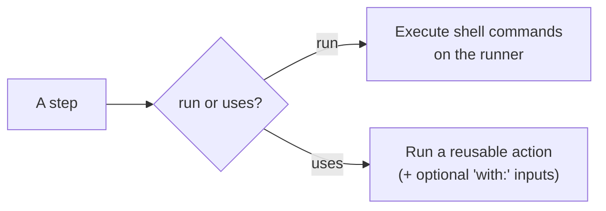

---

## 7 — Marketplace actions: checkout & setup-node

**Actions** are reusable units of automation published to the [GitHub Marketplace](https://github.com/marketplace?type=actions). Instead of writing everything from scratch, you `uses:` an action. Two you'll use constantly:

### 7.1 `actions/checkout` — [`10-checkout.yml`](day-01/workflows/10-checkout.yml)

**The most important thing to understand here:** a fresh runner does **not** have your code on it. It's empty. `actions/checkout` clones your repo onto the runner so later steps can see your files. **Almost every job starts with it.**

The example proves it: one job lists files *without* checkout (empty) and another *with* checkout (your files appear).

```yaml
- uses: actions/checkout@v5    # current major version
```

### 7.2 `actions/setup-node` — [`11-setup-node.yml`](day-01/workflows/11-setup-node.yml)

Installs a chosen Node.js version and puts it on the PATH. There's an equivalent for every ecosystem: `setup-python`, `setup-java`, `setup-go`, etc.

```yaml
- uses: actions/setup-node@v6    # current major version
  with:
    node-version: '20'
    cache: 'npm'                 # cache npm downloads to speed up future runs
    cache-dependency-path: 'sample-app/package-lock.json'   # WHERE the lockfile lives
```

> ⚠️ **`cache: 'npm'` needs a lockfile, and it needs to know where it is.** By default `setup-node` only looks in your repo **root**. Our app lives in `sample-app/`, so we point at it with `cache-dependency-path`. Miss this and the step fails with *"Dependencies lock file is not found"* — even though the file is sitting right there in the repo.
>
> The path is always relative to the **repo root** (not to any `working-directory`), and the file must exist **after checkout** — which is why `actions/checkout` always runs first.
>
> Good news: [`sample-app/`](sample-app/) already ships a ready-made `package-lock.json`, so you never have to generate one.
>
> **Version pinning (`@v5`, `@v6`):** the `@` picks which version of the action to run. Using the **major tag** (`@v5`) gets the latest v5.x. For maximum security, teams pin to a **full commit SHA** — a supply-chain topic covered later in the series.
>
> 📖 [`actions/checkout`](https://github.com/actions/checkout) · [`actions/setup-node`](https://github.com/actions/setup-node) · [Finding and customizing actions](https://docs.github.com/en/actions/learn-github-actions/finding-and-customizing-actions).

---

# Day 2 — From one job to a real pipeline

**Goal:** master custom variables, contexts and secrets, ship a complete single-job CI pipeline, then turn it into a **multi-job pipeline** — parallel jobs connected with `needs`, made conditional with `if` and status functions.

The workflow files continue in [`day-02/workflows/`](day-02/workflows/).

## 8 — Environment variables & scopes

### ▶️ [`12-env-scopes.yml`](day-02/workflows/12-env-scopes.yml)

`env:` defines your own variables at **three levels**. Inner scopes override outer ones.

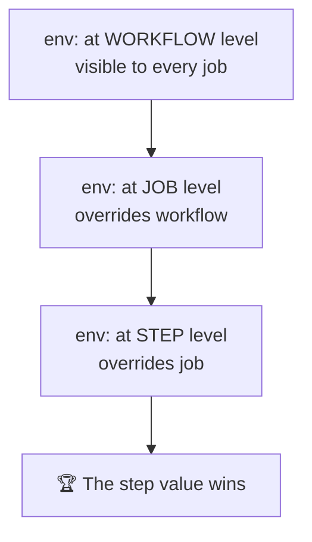

Read them two ways — and the difference matters:

| Syntax | Evaluated by | When to use |
|--------|--------------|-------------|
| `$NAME` | the **shell**, at runtime | inside `run:` |
| `${{ env.NAME }}` | **GitHub**, before the step starts | in `if:`, `with:`, `name:` |

**What to observe:** a variable defined at all three levels prints the **step** value; a variable defined only at workflow level is visible everywhere; and a job that defines its own value shadows the workflow one — but only for that job.

> ⚠️ Anything in `env:` is plain text and fully visible in logs. Credentials go in secrets (section 10), not here.

---

## 9 — Contexts & expressions

### ▶️ [`13-contexts.yml`](day-02/workflows/13-contexts.yml)

**Contexts** are read-only objects full of information about the run, accessed with `${{ ... }}`.

| Context | Gives you | Example |
|---------|-----------|---------|
| `github` | repo, event, actor, ref, sha, run number | `${{ github.repository }}` |
| `runner` | OS, arch, temp dirs | `${{ runner.os }}` |
| `env` | your custom variables | `${{ env.APP_NAME }}` |
| `secrets` | your stored secrets | `${{ secrets.MY_API_KEY }}` |
| `vars` | your repository variables | `${{ vars.YOUTUBE }}` |
| `needs` | upstream jobs' results & outputs | `${{ needs.build.result }}` |

💡 **The debugging trick worth remembering:**

```yaml
- env:
    GITHUB_CONTEXT: ${{ toJSON(github) }}
  run: echo "$GITHUB_CONTEXT"
```

Dump the whole context as JSON and read what's actually available, instead of guessing. (You'll use the same `toJSON()` trick on the `needs` context in section 13.)

> ⚠️ **Not every context is available everywhere.** `secrets` doesn't exist at workflow level, and `needs` doesn't exist without a `needs:` key. The [context availability table](https://docs.github.com/en/actions/learn-github-actions/contexts#context-availability) is the reference to bookmark.

---

## 10 — Secrets & variables

### ▶️ [`14-secrets.yml`](day-02/workflows/14-secrets.yml)

Never hard-code a token in a workflow file — the file lives in your git history forever.

**Create a secret:** `Settings → Secrets and variables → Actions → New repository secret` → name it `MY_API_KEY`.
**Create a variable:** the **Variables** tab, right next to it → name it `YOUTUBE`.

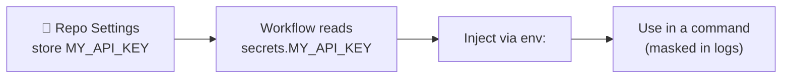

**Golden rules of secrets:**

- ✅ GitHub **masks** secret values in logs — they appear as `***`.
- ✅ Pass secrets through `env:` and consume them in a command. Don't `echo` them.
- ⚠️ Secrets are **not** sent to workflows triggered by pull requests **from forks**.
- 🔑 `GITHUB_TOKEN` is an automatic secret you never create — used to talk to the GitHub API.

**Secrets vs variables** — same UI, opposite purpose:

| | `secrets.X` | `vars.X` |
|---|---|---|
| Encrypted | ✅ | ❌ |
| Masked in logs | ✅ (`***`) | ❌ (printed in full) |
| Use for | tokens, passwords, keys | URLs, channel names, feature flags |

The example reads both: a **secret** (`MY_API_KEY`, masked) and a **variable** (`vars.YOUTUBE`, printed in the clear). Putting a URL in a secret is a common mistake — masking it turns your logs into a wall of `***`.

---

## 11 — 🚀 Your first CI pipeline (capstone)

### ▶️ [`15-node-ci-combined.yml`](day-02/workflows/15-node-ci-combined.yml)

Now combine **everything so far**: triggers, a runner, checkout, setup-node, `env`, contexts and a real install → lint → test flow, against the [`sample-app/`](sample-app/) at the repo root.

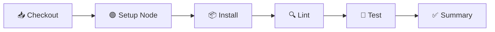

**The subfolder rule** — our code isn't at the repo root, it's in `sample-app/`. A `run:` step always starts at the repo root, so set the working directory once for the whole job:

```yaml
jobs:
  build-and-test:
    defaults:
      run:
        working-directory: sample-app   # every `run:` step starts here
```

> 🔑 **The catch that trips everyone up:** `defaults.run.working-directory` applies to **`run:` steps only**. Paths given to a `uses:` action are **always** relative to the repo root — which is why the same folder name appears twice, in two forms:

| Setting | Applies to | Value | Relative to |
|---|---|---|---|
| `defaults.run.working-directory` | every `run:` step | `sample-app` | repo root |
| `cache-dependency-path` | the `setup-node` **action** | `sample-app/package-lock.json` | repo root |

**Break it on purpose to learn to read failures:** change `assert.equal(add(2, 3), 5)` to `6` in `test/math.test.js`, commit, read the red step, fix it back to `5`, commit again → green.

**Status badge (optional flex)** — put this near the top of your practice repo's README (replace `USER/REPO`):

```markdown

```

---

## 12 — Many jobs run in parallel

### ▶️ [`16-parallel-jobs.yml`](day-02/workflows/16-parallel-jobs.yml)

Add a second job and GitHub starts it **immediately, in parallel, on a completely separate machine**.

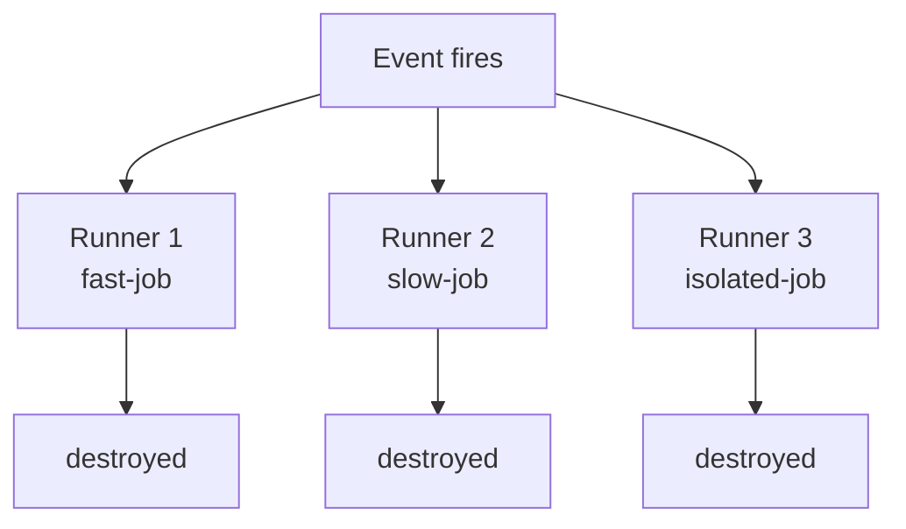

**The two facts that matter:**

1. **Order in the file means nothing.** Writing a job last does not make it run last. Only `needs:` creates order (section 13).
2. **Nothing is shared.** Not files, not installed tools, not environment variables. A file written in job A is gone forever as far as job B is concerned. To pass data between jobs you need **outputs** or **artifacts** (coming up later in the series).

**What to observe:** the graph view shows three boxes side by side, all starting at the same second.

---

## 13 — `needs` — building a pipeline

### ▶️ [`17-needs-dependencies.yml`](day-02/workflows/17-needs-dependencies.yml)

`needs:` is the keyword that turns a pile of jobs into a pipeline: *"don't start until those finished successfully."*

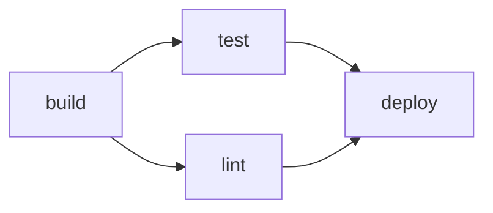

```yaml
jobs:
  build: { ... }
  test:   { needs: build }          # single dependency
  lint:   { needs: build }          # runs in parallel with test
  deploy: { needs: [test, lint] }   # fan-in: waits for BOTH
```

**Rules worth memorising:**

- A failed dependency makes downstream jobs **skipped** (grey), not failed — override with `always()` (section 15).
- You get the `needs` context: `needs.<job>.result` and `needs.<job>.outputs.<name>`.
- Cycles are rejected before the workflow runs.

💡 Same debugging trick as contexts — dump the whole thing to see what a job inherited from its dependencies:

```yaml
- env:
    NEEDS_DATA: ${{ toJSON(needs) }}
  run: echo "$NEEDS_DATA"
```

**What to observe:** `deploy` sits idle until both `test` and `lint` finish. In the example `lint` fails on purpose (`exit 1`) — watch `deploy` turn **grey (skipped), not red**. Downstream jobs are skipped when a dependency fails, and a skipped job does not by itself fail the run.

---

## 14 — `if` — conditional jobs and steps

### ▶️ [`18-if-conditionals.yml`](day-02/workflows/18-if-conditionals.yml)

`if:` sits on a **job** or a **step**. False → skipped, and skipped is not failed.

```yaml
if: github.event_name == 'push' && github.ref == 'refs/heads/main'
```

Operators: `==` `!=` `&&` `||` `!`, plus `contains()`, `startsWith()`, `endsWith()`.

> ⚠️ **The gotcha that costs everyone an hour.** `if:` is *already* an expression context, so `${{ }}` is optional — but quoting is not harmless:
>
> | You write | GitHub sees |
> |---|---|
> | `if: ${{ false }}` | false ✅ |
> | `if: false` | false ✅ |
> | `if: 'false'` | **TRUE** — a non-empty string, and every non-empty string is truthy ❌ |
>
> Write conditions **without** `${{ }}` and **never quote booleans**.

**What to observe:** run it manually, then push to `main`, and compare which jobs are grey in each run.

---

## 15 — Status functions

### ▶️ [`19-status-functions.yml`](day-02/workflows/19-status-functions.yml)

Four functions let a job react to what happened before it:

| Function | True when |
|---|---|
| `success()` | nothing so far failed — **the invisible default** |
| `failure()` | something upstream failed |
| `cancelled()` | the run was cancelled |
| `always()` | always, including cancellation |

**The rule that explains all the confusing behaviour:**

> Every job and step has an invisible `if: success()` on it. That's why a job whose `needs` failed turns grey. The moment you write a status function yourself, that default is **removed** and your expression alone decides.

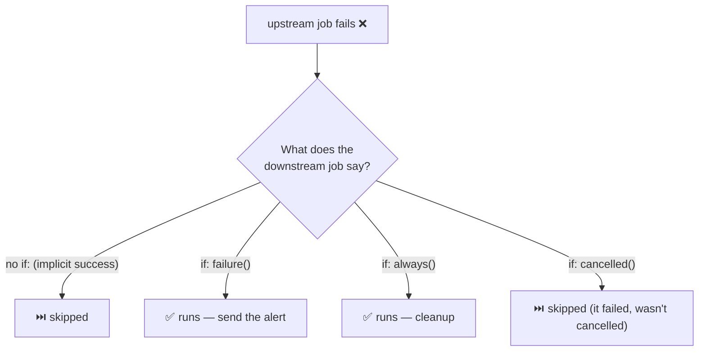

**Where you actually use this:** Slack alerts on failure, uploading logs from a failed run, and teardown jobs that must destroy infrastructure even when the deploy exploded.

**What to observe:** the first job fails on purpose — see which of the reporter jobs are green and which are grey. A common real-world variant is in the file too: `if: failure() && github.ref == 'refs/heads/main'` — alert, but only when it's `main` that broke.

---

## 🧾 Cheat sheet

```yaml
name: My Workflow            # display name in the Actions tab

on:                          # WHEN it runs
  push:
    branches: [main]
  pull_request:
  workflow_dispatch:         # manual button
  schedule:
    - cron: '0 2 * * *'      # UTC

env:                         # variables (workflow scope)
  NODE_VERSION: '20'

jobs:                        # WHAT runs (parallel by default)
  build:                     # job id
    runs-on: ubuntu-latest   # the runner
    defaults:
      run:
        working-directory: sample-app   # affects run: steps only
    steps:                   # in order, top to bottom
      - uses: actions/checkout@v5           # reusable action
      - uses: actions/setup-node@v6
        with:                               # inputs to the action
          node-version: ${{ env.NODE_VERSION }}
          cache: 'npm'
          cache-dependency-path: 'sample-app/package-lock.json'
      - run: npm ci                         # shell command
      - run: npm test

  deploy:
    needs: build                            # run only after build succeeds
    if: github.ref == 'refs/heads/main'     # ...and only on main
    runs-on: ubuntu-latest
    steps:
      - run: echo "deploying"

  notify:
    needs: [build, deploy]
    if: always()                            # run whatever happened
    runs-on: ubuntu-latest
    steps:
      - run: echo "build was ${{ needs.build.result }}"
```

| I want to… | Use |
|------------|-----|
| Run on every push | `on: push` |
| Test PRs before merge | `on: pull_request` |
| Add a manual button | `on: workflow_dispatch` |
| Run on a timer | `on: schedule` + `cron` |
| Get my code onto the runner | `uses: actions/checkout@v5` |
| Install Node | `uses: actions/setup-node@v6` |
| Run a shell command | `run:` |
| Pass input to an action | `with:` |
| Store a password/token | Repo secret + `${{ secrets.NAME }}` |
| Store non-secret config | Repo variable + `${{ vars.NAME }}` |
| Read run info | Contexts: `${{ github.* }}`, `${{ runner.* }}` |
| Custom variable (3 scopes) | `env:` at workflow / job / step |
| Make jobs run in order | `needs:` |
| Run a job only on main | `if: github.ref == 'refs/heads/main'` |
| Run cleanup even on failure | `if: always()` |
| Alert only on failure | `if: failure()` |

---

## 🔗 Reference links

**Official documentation**

- [GitHub Actions documentation (home)](https://docs.github.com/en/actions)
- [Quickstart for GitHub Actions](https://docs.github.com/en/actions/quickstart)
- [Understanding GitHub Actions (core concepts)](https://docs.github.com/en/actions/learn-github-actions/understanding-github-actions)
- [Workflow syntax reference](https://docs.github.com/en/actions/using-workflows/workflow-syntax-for-github-actions)
- [Events that trigger workflows](https://docs.github.com/en/actions/reference/events-that-trigger-workflows)
- [Contexts](https://docs.github.com/en/actions/learn-github-actions/contexts) · [Expressions](https://docs.github.com/en/actions/learn-github-actions/expressions)
- [Using secrets](https://docs.github.com/en/actions/security-guides/using-secrets-in-github-actions) · [Variables](https://docs.github.com/en/actions/learn-github-actions/variables)
- [Using jobs — `needs`, `if`, outputs](https://docs.github.com/en/actions/using-jobs/using-jobs-in-a-workflow)

**Hands-on / learning**

- [GitHub Skills: interactive Actions courses](https://skills.github.com/)
- [Awesome Actions (curated list)](https://github.com/sdras/awesome-actions)

**Tools**

- [crontab.guru — build cron expressions](https://crontab.guru)
- [YAML Lint — validate your YAML](http://www.yamllint.com/)
- [GitHub Actions VS Code extension](https://marketplace.visualstudio.com/items?itemName=github.vscode-github-actions)

---

## ⏭️ Coming up next

With a multi-job pipeline in hand, the series continues into real pipeline engineering:

- **Job outputs** — passing values (a version, a tag) between jobs with `$GITHUB_OUTPUT`
- **Matrix builds** — test across many Node versions and OSes at once
- **Caching** dependencies and sharing files between jobs with **artifacts (v4)**
- **Reusable workflows** and **composite actions** — stop copy-pasting YAML
- **`GITHUB_TOKEN` permissions**, **environments** with approval gates, and **concurrency** control
- **Security hardening** — SHA-pinning, OIDC keyless cloud auth, and publishing your own actions

The prebuilt workflow files for these topics are already in [`day-02/workflows/`](day-02/workflows/) (`20`–`34`) and [`day-02/actions/`](day-02/actions/) if you want to read ahead. See you in the next video! 🚀
