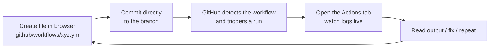
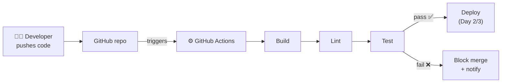
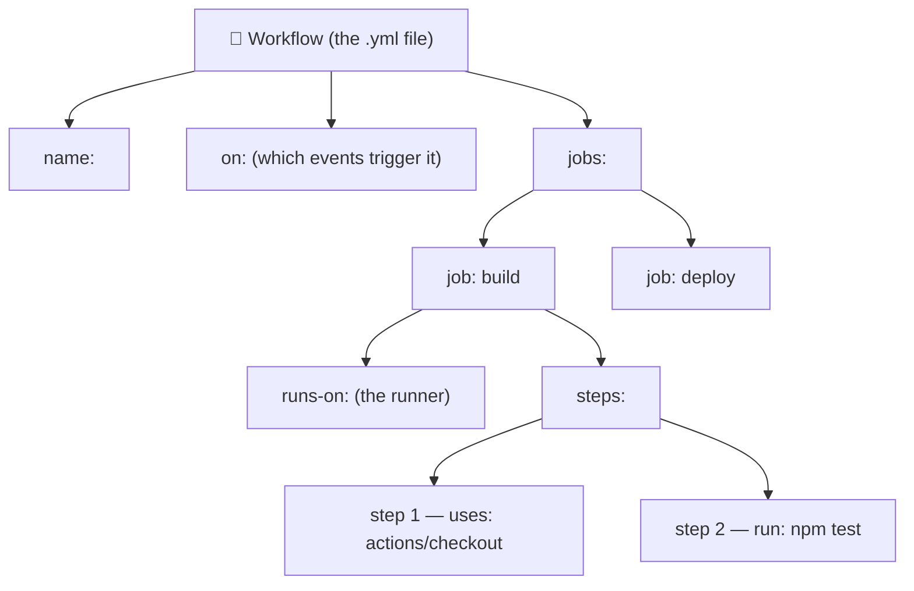
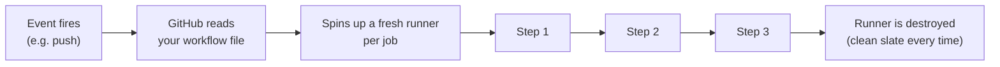
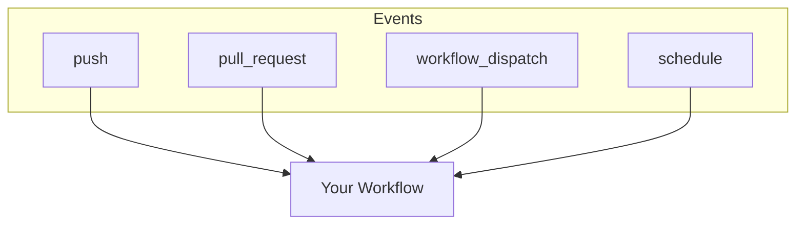
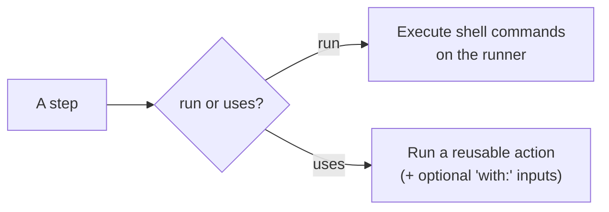

# Day 1 — GitHub Actions Foundations

> **Goal for today:** Go from *"I've never written a line of YAML"* to *shipping a working CI pipeline* that automatically lints and tests your code every time you push — all from the browser, no local setup required.

This document is **both** the teaching script (for the video) **and** a self-study guide. Every concept below has:

1. **What it is** — a plain-English explanation of the keyword.
2. **A tiny example** — a small, focused YAML file you can copy-paste and run.
3. **What to observe** — what you should see in the **Actions** tab.

At the end, one **combined capstone** brings all the pieces together into a real CI pipeline.

---

## 📚 Table of Contents

1. [How to use this course (browser-only workflow)](#0--how-to-use-this-course-browser-only)
2. [What is CI/CD and where does GitHub Actions fit?](#1--what-is-cicd-and-where-does-github-actions-fit)
3. [YAML in 10 minutes](#2--yaml-in-10-minutes)
4. [Anatomy of a workflow](#3--anatomy-of-a-workflow)
5. [Triggers — the `on` keyword](#4--triggers--the-on-keyword)
6. [Runners — the `runs-on` keyword](#5--runners--the-runs-on-keyword)
7. [Steps: `run` vs `uses`](#6--steps-run-vs-uses)
8. [Marketplace actions: checkout & setup-node](#7--marketplace-actions-checkout--setup-node)
9. [What's next — Day 2 starts here](#8--whats-next--day-2-starts-here)
10. [Day 1 cheat sheet](#-day-1-cheat-sheet)
11. [Reference links](#-reference-links)

---

## 0 — How to use this course (browser-only)

You do **not** need to install anything. We work entirely in the GitHub website.

### One-time setup

1. Sign in to [github.com](https://github.com).
2. Click **New repository** → name it `github-actions-practice` → check **Add a README** → **Create repository**.

### The loop we repeat all day



**To add a workflow file in the browser:**

1. Click **Add file → Create new file**.
2. In the filename box, type: `.github/workflows/01-hello-world.yml`
   - ⚠️ The folder path **must** be exactly `.github/workflows/`. GitHub only looks there.
3. Paste the YAML content.
4. Scroll down → **Commit changes** (commit directly to `main` for practice).
5. Click the **Actions** tab to watch it run.

> 💡 **Where files live in this course:** Day 1's copy-paste YAML files are in [`day-01/workflows/`](workflows/), numbered `01`–`11`. Numbering continues across the whole course, so Day 2 picks up at `12` in [`day-02/workflows/`](../day-02/workflows/). The sample app used from Day 1 onwards is in [`sample-app/`](../sample-app/) at the repo root.
>
> 📦 **Everything is prebuilt — nothing to generate.** Clone or download this repo (link in the video description) and you get every workflow file plus a complete, ready-to-run sample app, `package-lock.json` included. There is no setup step, no `npm install` on your machine, and no lockfile to create. Copy, commit, watch it run.

---

## 1 — What is CI/CD and where does GitHub Actions fit?

**CI — Continuous Integration:** every time a developer pushes code, it is automatically **built, linted, and tested**. Bugs are caught in minutes, not weeks.

**CD — Continuous Delivery/Deployment:** after tests pass, the code is automatically **packaged and shipped** to a server, app store, or cloud (we get here on Day 2 & 3).

Without automation, every developer has to *remember* to test and deploy manually. That doesn't scale and humans forget. CI/CD makes it automatic and repeatable.



**GitHub Actions** is GitHub's **built-in automation engine**. It lives inside your repository — no separate server like Jenkins to maintain. You describe *what should happen and when* in a YAML file, and GitHub runs it on a machine it provides for free (within limits).

**The mental model — remember these 5 words:**

| Term | Meaning |
|------|---------|
| **Event** | Something that happens (a push, a PR, a schedule, a button click). |
| **Workflow** | The automated process, defined in a `.yml` file, that runs when an event fires. |
| **Job** | A group of steps that run together on one runner. A workflow can have many jobs. |
| **Step** | A single task: either a shell command (`run`) or a reusable action (`uses`). |
| **Runner** | The virtual machine that executes a job. |

> **Pricing note:** GitHub Actions is **free for public repositories**. Private repos get a monthly free allotment of minutes/storage, then pay-as-you-go. See [About billing for Actions](https://docs.github.com/en/billing/managing-billing-for-github-actions/about-billing-for-github-actions).

---

## 2 — YAML in 10 minutes

Workflow files are written in **YAML** (`.yml` or `.yaml`). YAML is just a way to write structured data that's easy for humans to read. You only need a handful of rules:

```yaml
# 1. Comments start with a hash.

# 2. Key-value pairs use a colon + space:
name: My Workflow

# 3. INDENTATION defines structure. Use SPACES, never TABs.
#    (2 spaces per level is the convention.)
jobs:
  build:
    runs-on: ubuntu-latest

# 4. A list (sequence) uses dashes:
branches:
  - main
  - develop
# ...or inline (flow) style:
branches: [main, develop]

# 5. A map (object) is a set of key-values:
with:
  node-version: '20'
  cache: 'npm'

# 6. Multi-line strings:
run: |          # the "|" keeps line breaks (each line runs)
  echo "line 1"
  echo "line 2"
```

**The #1 beginner mistake:** wrong indentation, or using a **TAB** instead of spaces. YAML will reject tabs. When in doubt, count your spaces.

> 🧰 **Validate before you commit:** paste your YAML into [yamllint.com](http://www.yamllint.com/) or the [GitHub Actions VS Code extension](https://marketplace.visualstudio.com/items?itemName=github.vscode-github-actions) to catch indentation errors early.

---

## 3 — Anatomy of a workflow

Every workflow follows the same shape. Here is the hierarchy:



**How a run actually executes:**



**Key facts to internalize:**
- Jobs run **in parallel** by default (unless you connect them — Day 2).
- Steps within a job run **in order, top to bottom**.
- Each job gets a **brand-new, clean runner**. Nothing carries over between jobs unless you explicitly pass it (artifacts/outputs — Day 2).
- If any step fails, the remaining steps are **skipped** and the job is marked failed (by default).

### ▶️ Example — [`01-hello-world.yml`](workflows/01-hello-world.yml)

The smallest possible workflow. It has one job, `say-hello`, with two steps.

**Do this now:**
1. Create `.github/workflows/01-hello-world.yml` in the browser, paste the file.
2. Go to **Actions → 01 - Hello World → Run workflow** (because it uses `workflow_dispatch`).
3. Click into the run and read the log of each step.

**What to observe:** the two steps run in order; the second step reads built-in variables like `$RUNNER_OS`.

---

## 4 — Triggers — the `on` keyword

`on:` decides **when** your workflow runs. This is the single most important keyword to master. Below are the events you'll use daily.

### 4.1 `push` — [`02-on-push.yml`](workflows/02-on-push.yml)
Runs on every push. The classic "test my code as soon as it changes" trigger.

### 4.2 `pull_request` — [`03-on-pull-request.yml`](workflows/03-on-pull-request.yml)
Runs when a PR is opened or updated. This is how you gate code **before** it merges. Try it: create a new branch in the browser, edit a file, and open a PR — watch the workflow run on the PR.

### 4.3 Filters: branches & paths — [`04-on-branches-paths.yml`](workflows/04-on-branches-paths.yml)
Only run when it matters — e.g., only on `main`, or only when files under `sample-app/` change. Saves minutes and noise.

> ⚠️ **`paths` are matched from the repo root.** Since our app sits in `sample-app/`, the filter has to say `sample-app/**`. Writing `src/**` would match nothing and the workflow would silently never run — a genuinely confusing bug to chase.
>
> ⚠️ Use **either** `branches` **or** `branches-ignore`, never both. Same for `paths`/`paths-ignore`.

### 4.4 `workflow_dispatch` — [`05-on-workflow-dispatch.yml`](workflows/05-on-workflow-dispatch.yml)
Adds a manual **"Run workflow"** button, optionally with **inputs** (dropdowns, text, checkboxes). Perfect for deployments and one-off tasks.

### 4.5 `schedule` (cron) — [`06-on-schedule.yml`](workflows/06-on-schedule.yml)
Run on a timer — nightly builds, health checks, cleanups. **Times are in UTC.** Build cron expressions with [crontab.guru](https://crontab.guru).

### 4.6 Combine them — [`07-on-multiple-events.yml`](workflows/07-on-multiple-events.yml)
Real workflows listen to several events at once: push to `main` + every PR + a manual button. This is the standard CI setup.



> 📖 Full event list: [Events that trigger workflows](https://docs.github.com/en/actions/reference/events-that-trigger-workflows).

---

## 5 — Runners — the `runs-on` keyword

A **runner** is the virtual machine that executes your job. GitHub hosts fresh runners for you: **Linux, Windows, and macOS**, each pre-loaded with common tools (Git, Node, Python, Docker, etc.).

### ▶️ Example — [`08-runs-on-and-runner-context.yml`](workflows/08-runs-on-and-runner-context.yml)

Shows three jobs, one per OS, each printing details about its runner.

| Label | Use it for | Notes |
|-------|-----------|-------|
| `ubuntu-latest` | 90% of jobs | Fastest, cheapest — **default choice**. |
| `windows-latest` | Windows-specific builds | Default shell is PowerShell. |
| `macos-latest` | iOS/macOS builds | Uses more billed minutes. |

> **Self-hosted runners** (your own machines) exist for special needs — that's a **Day 3** topic. For everything today, GitHub-hosted runners are perfect.
>
> 📖 [About GitHub-hosted runners](https://docs.github.com/en/actions/using-github-hosted-runners/about-github-hosted-runners/about-github-hosted-runners).

---

## 6 — Steps: `run` vs `uses`

Every step does exactly **one** of two things:

| Keyword | What it does | Example |
|---------|--------------|---------|
| `run:` | Runs shell command(s) on the runner. | `run: npm test` |
| `uses:` | Runs a prebuilt **action** (reusable code). | `uses: actions/checkout@v5` |

You pass **inputs** to a `uses:` action with the `with:` block.

### ▶️ Example — [`09-run-vs-uses.yml`](workflows/09-run-vs-uses.yml)



---

## 7 — Marketplace actions: checkout & setup-node

**Actions** are reusable units of automation published to the [GitHub Marketplace](https://github.com/marketplace?type=actions). Instead of writing everything from scratch, you `uses:` an action. Two you'll use constantly:

### 7.1 `actions/checkout` — [`10-checkout.yml`](workflows/10-checkout.yml)

**The most important thing to understand today:** a fresh runner does **not** have your code on it. It's empty. `actions/checkout` clones your repo onto the runner so later steps can see your files. **Almost every job starts with it.**

The example proves it: one job lists files *without* checkout (empty) and another *with* checkout (your files appear).

```yaml
- uses: actions/checkout@v5    # current major version
```

### 7.2 `actions/setup-node` — [`11-setup-node.yml`](workflows/11-setup-node.yml)

Installs a chosen Node.js version and puts it on the PATH. There's an equivalent for every ecosystem: `setup-python`, `setup-java`, `setup-go`, etc.

```yaml
- uses: actions/setup-node@v6    # current major version
  with:
    node-version: '20'
    cache: 'npm'                 # caching = Day 2 topic, but this is how you turn it on
    cache-dependency-path: 'sample-app/package-lock.json'   # WHERE the lockfile lives
```

> ⚠️ **`cache: 'npm'` needs a lockfile, and it needs to know where it is.** By default `setup-node` only looks in your repo **root**. Our app lives in `sample-app/`, so we point at it with `cache-dependency-path`. Miss this and the step fails with *"Dependencies lock file is not found"* — even though the file is sitting right there in the repo.
>
> The path is always relative to the **repo root** (not to any `working-directory`), and the file must exist **after checkout** — which is why `actions/checkout` always runs first.
>
> Good news: [`sample-app/`](../sample-app/) already ships a ready-made `package-lock.json`, so you never have to generate one.
>
> **Version pinning (`@v5`, `@v6`):** the `@` picks which version of the action to run. Using the **major tag** (`@v5`) gets the latest v5.x. For maximum security, teams pin to a **full commit SHA** — we cover *why* and *how* in depth on **Day 3 (supply-chain security)**.
>
> 📖 [`actions/checkout`](https://github.com/actions/checkout) · [`actions/setup-node`](https://github.com/actions/setup-node) · [Finding and customizing actions](https://docs.github.com/en/actions/learn-github-actions/finding-and-customizing-actions).

---

## 8 — What's next — Day 2 starts here

That is Day 1. You can now read and write workflow YAML, trigger it on any event, pick a runner, tell `run` from `uses`, and pull your code and a Node toolchain onto a runner with Marketplace actions.

**Day 2 opens by finishing the foundations**, using the same practice repo and the same numbering — the files simply continue in [`day-02/workflows/`](../day-02/workflows/):

| # | Topic | File |
|---|-------|------|
| 12 | **Environment variables** and their three scopes (workflow / job / step) | [`12-env-scopes.yml`](../day-02/workflows/12-env-scopes.yml) |
| 13 | **Contexts & expressions** — `github`, `runner`, `env`, and the `toJSON` debugging trick | [`13-contexts.yml`](../day-02/workflows/13-contexts.yml) |
| 14 | **Secrets** — storing them, masking, and the fork-PR rule | [`14-secrets.yml`](../day-02/workflows/14-secrets.yml) |
| 15 | 🚀 **The foundations capstone** — a complete Node.js CI pipeline | [`15-node-ci-combined.yml`](../day-02/workflows/15-node-ci-combined.yml) |

Then Day 2 moves into real pipeline engineering: multi-job DAGs with `needs`, `if` and status functions, job outputs, **matrix** builds, **caching**, **artifacts v4**, **reusable workflows** and **composite actions**, least-privilege `GITHUB_TOKEN` permissions, **environments with approval gates**, and `concurrency`.

👉 **Continue to [Day 2 — Real Pipelines](../day-02/README.md).**

---

## 🧾 Day 1 cheat sheet

```yaml
name: My Workflow            # display name in the Actions tab

on:                          # WHEN it runs
  push:
    branches: [main]
  pull_request:
  workflow_dispatch:         # manual button
  schedule:
    - cron: '0 2 * * *'      # UTC

env:                         # variables (workflow scope)
  NODE_VERSION: '20'

jobs:                        # WHAT runs (parallel by default)
  build:                     # job id
    runs-on: ubuntu-latest   # the runner
    steps:                   # in order, top to bottom
      - uses: actions/checkout@v5           # reusable action
      - uses: actions/setup-node@v6
        with:                               # inputs to the action
          node-version: ${{ env.NODE_VERSION }}
      - run: npm install                    # shell command
      - run: npm test
```

| I want to… | Use |
|------------|-----|
| Run on every push | `on: push` |
| Test PRs before merge | `on: pull_request` |
| Add a manual button | `on: workflow_dispatch` |
| Run on a timer | `on: schedule` + `cron` |
| Get my code onto the runner | `uses: actions/checkout@v5` |
| Install Node | `uses: actions/setup-node@v6` |
| Run a shell command | `run:` |
| Pass input to an action | `with:` |
| Store a password/token | Repo secret + `${{ secrets.NAME }}` *(Day 2)* |
| Read run info | Contexts: `${{ github.* }}`, `${{ runner.* }}` *(Day 2)* |

---

## 🔗 Reference links

**Official documentation**
- [GitHub Actions documentation (home)](https://docs.github.com/en/actions)
- [Quickstart for GitHub Actions](https://docs.github.com/en/actions/quickstart)
- [Understanding GitHub Actions (core concepts)](https://docs.github.com/en/actions/learn-github-actions/understanding-github-actions)
- [Workflow syntax reference](https://docs.github.com/en/actions/using-workflows/workflow-syntax-for-github-actions)
- [Events that trigger workflows](https://docs.github.com/en/actions/reference/events-that-trigger-workflows)
- [Contexts](https://docs.github.com/en/actions/learn-github-actions/contexts) · [Expressions](https://docs.github.com/en/actions/learn-github-actions/expressions)
- [Using secrets](https://docs.github.com/en/actions/security-guides/using-secrets-in-github-actions)

**Hands-on / learning**
- [GitHub Skills: interactive Actions courses](https://skills.github.com/)
- [Awesome Actions (curated list)](https://github.com/sdras/awesome-actions)

**Tools**
- [crontab.guru — build cron expressions](https://crontab.guru)
- [YAML Lint — validate your YAML](http://www.yamllint.com/)
- [GitHub Actions VS Code extension](https://marketplace.visualstudio.com/items?itemName=github.vscode-github-actions)

---

## ⏭️ Continue to Day 2

Day 2 finishes the foundations (env, contexts, secrets and the CI capstone — see [section 8](#8--whats-next--day-2-starts-here)) and then turns this single job into a **real multi-stage pipeline**.

👉 **[Day 2 — Real Pipelines: Jobs, Matrix, Reuse & Deployment Gates](../day-02/README.md)**

See you there! 🚀
