# Day 2 — Real Pipelines: Jobs, Matrix, Reuse & Deployment Gates

> **Goal for today:** Turn yesterday's single job into a **real multi-stage pipeline** — parallelised, cached, connected by artifacts, made maintainable with reusable building blocks, locked down with least-privilege permissions, and gated behind a human approval before production.

Same format as Day 1. This document is **both** the teaching script (for the video) **and** a self-study guide. Every concept has:

1. **What it is** — a plain-English explanation of the keyword.
2. **A tiny example** — a focused YAML file you can copy-paste and run.
3. **What to observe** — what you should see in the **Actions** tab.

We start by **finishing Day 1** (sections 1–4 are the four topics we ran out of time for), then build the real pipeline.

---

## 📚 Table of Contents

**Part 0 — Finishing Day 1**
1. [Environment variables & scopes](#1--environment-variables--scopes)
2. [Contexts & expressions](#2--contexts--expressions)
3. [Secrets](#3--secrets)
4. [Foundations capstone — your first CI pipeline](#4--foundations-capstone--your-first-ci-pipeline)

**Part A — Orchestrating jobs**

5. [Many jobs, and why they're isolated](#5--many-jobs-and-why-theyre-isolated)
6. [`needs` — building a pipeline](#6--needs--building-a-pipeline)
7. [`if` — conditional jobs and steps](#7--if--conditional-jobs-and-steps)
8. [Status functions — `success()`, `failure()`, `always()`](#8--status-functions)
9. [Job outputs — passing data between jobs](#9--job-outputs--passing-data-between-jobs)

**Part B — Doing more with less**

10. [Matrix builds](#10--matrix-builds)
11. [Caching](#11--caching)
12. [Artifacts (v4)](#12--artifacts-v4)

**Part C — Reuse**

13. [Reusable workflows, composite actions & the decision guide](#13--reuse-reusable-workflows-vs-composite-actions)

**Part D — Security & control**

14. [`GITHUB_TOKEN` and least-privilege permissions](#14--github_token-and-least-privilege-permissions)
15. [Environments, deployment gates & approvals](#15--environments-deployment-gates--approvals)
16. [Concurrency](#16--concurrency)
17. [Timeouts & `continue-on-error`](#17--timeouts--continue-on-error)

**Part E**

18. [🚀 Capstone — a full build → test → deploy pipeline](#18---capstone--a-full-build--test--deploy-pipeline)
19. [Day 2 cheat sheet](#-day-2-cheat-sheet)
20. [Reference links](#-reference-links)

---

## 0 — Where we are, and today's map

Day 1 gave you the vocabulary: **event → workflow → job → step → runner**, and a single job that checks out, installs, lints and tests.

Everything today is about the gap between *"a job that runs my tests"* and *"a pipeline my team can depend on."*

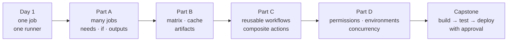

### Setup (same as Day 1 — browser only)

You need the same practice repo and the same `sample-app/` folder at its root. Nothing new to install.

> 📦 **One small addition to `sample-app/` since Day 1:** it now has a `build.js` and an `npm run build` script that produces a `dist/` folder. Day 1 never used it; today we need something real to upload as an artifact. If you copied `sample-app/` yesterday, **copy it again** to pick up the new files.

| File | Purpose |
|------|---------|
| `package.json` | Now has three scripts: `lint`, `test`, **`build`** |
| `build.js` | **New.** Zero-dependency "build" — copies `src/` to `dist/` and stamps `build-info.json` |
| `.gitignore` | **New.** Keeps `dist/` out of git — the pipeline regenerates it |

All of today's workflow files are in [`day-02/workflows/`](workflows/), and the composite action is in [`day-02/actions/`](actions/).

---

# Part 0 — Finishing Day 1

## 1 — Environment variables & scopes

### ▶️ [`12-env-scopes.yml`](workflows/12-env-scopes.yml)

`env:` defines your own variables at **three levels**. Inner scopes override outer ones.

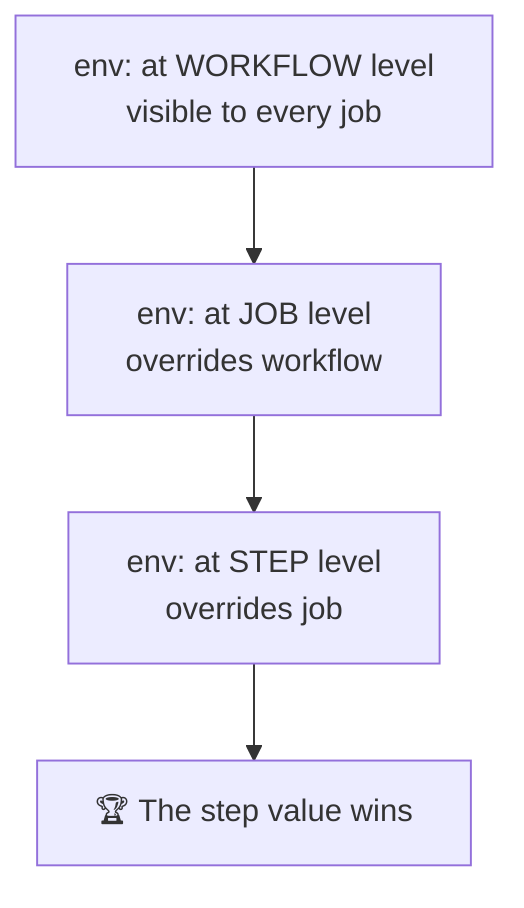

Read them two ways — and the difference matters:

| Syntax | Evaluated by | When to use |
|--------|--------------|-------------|
| `$NAME` / `$env:NAME` | the **shell**, at runtime | inside `run:` |
| `${{ env.NAME }}` | **GitHub**, before the step starts | in `if:`, `with:`, `name:` |

**What to observe:** `STAGE` prints a different value in each step, while `APP_NAME` stays constant.

> ⚠️ Anything in `env:` is plain text and fully visible in logs. Credentials go in secrets (section 3), not here.

---

## 2 — Contexts & expressions

### ▶️ [`13-contexts.yml`](workflows/13-contexts.yml)

**Contexts** are read-only objects full of information about the run, accessed with `${{ ... }}`.

| Context | Gives you | Example |
|---------|-----------|---------|
| `github` | repo, event, actor, ref, sha, run number | `${{ github.repository }}` |
| `runner` | OS, arch, temp dirs | `${{ runner.os }}` |
| `env` | your custom variables | `${{ env.APP_NAME }}` |
| `secrets` | your stored secrets | `${{ secrets.MY_API_KEY }}` |
| `vars` | repo/environment **variables** | `${{ vars.API_URL }}` |
| `needs` | upstream jobs' results & outputs | `${{ needs.build.outputs.version }}` |
| `matrix` | the current matrix row | `${{ matrix.node }}` |
| `steps` | earlier steps' outputs & outcome | `${{ steps.build.outputs.sha }}` |

The last four are new today — they are the machinery behind everything in Parts A and B.

💡 **The debugging trick worth remembering:**

```yaml
- env:
    GITHUB_CONTEXT: ${{ toJSON(github) }}
  run: echo "$GITHUB_CONTEXT"
```

Dump the whole context as JSON and read what's actually available, instead of guessing.

> ⚠️ **Not every context is available everywhere.** `secrets` doesn't exist at workflow level, `needs` doesn't exist without a `needs:` key, and `matrix` only exists inside a matrix job. The [context availability table](https://docs.github.com/en/actions/learn-github-actions/contexts#context-availability) is the reference to bookmark.

---

## 3 — Secrets

### ▶️ [`14-secrets.yml`](workflows/14-secrets.yml)

Never hard-code a token in a workflow file — the file lives in your git history forever.

**Create one:** `Settings → Secrets and variables → Actions → New repository secret` → name it `MY_API_KEY`.

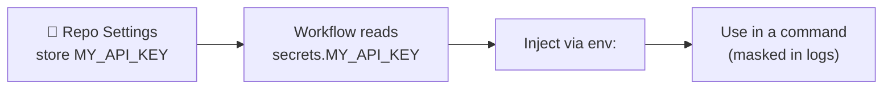

**Golden rules:**

- ✅ GitHub **masks** secret values in logs — they appear as `***`.
- ✅ Pass secrets through `env:` and consume them in a command. Don't `echo` them.
- ⚠️ Secrets are **not** sent to workflows triggered by pull requests **from forks**.
- 🔑 `GITHUB_TOKEN` is an automatic secret you never create — section 14.

**Secrets vs variables** — a distinction we lean on heavily in section 15:

| | `secrets.X` | `vars.X` |
|---|---|---|
| Encrypted | ✅ | ❌ |
| Masked in logs | ✅ | ❌ |
| Use for | tokens, passwords, keys | URLs, regions, feature flags |

Putting a URL in a secret is a common mistake — masking it turns your logs into a wall of `***`.

---

## 4 — Foundations capstone — your first CI pipeline

### ▶️ [`15-node-ci-combined.yml`](workflows/15-node-ci-combined.yml)

This is the Day 1 hands-on, and the last thing we do before today's real material. It combines triggers, a runner, checkout, setup-node, `env`, contexts and a build → lint → test flow.

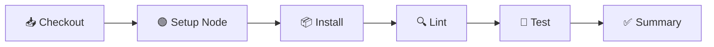

**The subfolder rule, restated because it bites all day today:**

| Setting | Applies to | Value | Relative to |
|---|---|---|---|
| `defaults.run.working-directory` | every `run:` step | `sample-app` | repo root |
| `cache-dependency-path` | the `setup-node` **action** | `sample-app/package-lock.json` | repo root |

> 🔑 `defaults.run.working-directory` affects **`run:` steps only**. Paths given to a `uses:` action are **always** relative to the repo root. Every artifact upload today repeats this pattern.

**Break it on purpose:** change `assert.equal(add(2, 3), 5)` to `6`, commit, read the red step, fix it. Learning to read a failure is the actual skill.

---

# Part A — Orchestrating jobs

## 5 — Many jobs, and why they're isolated

### ▶️ [`16-parallel-jobs.yml`](workflows/16-parallel-jobs.yml)

Add a second job and GitHub starts it **immediately, in parallel, on a completely separate machine**.

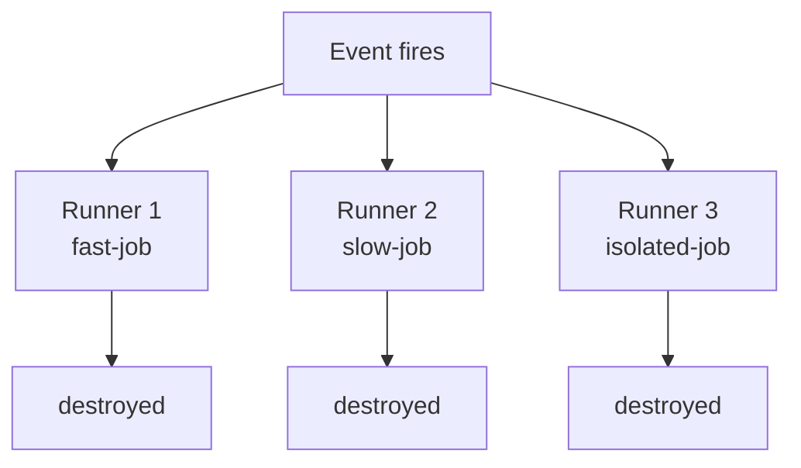

**The two facts that matter:**

1. **Order in the file means nothing.** Writing a job last does not make it run last. Only `needs:` creates order.
2. **Nothing is shared.** Not files, not installed tools, not environment variables. A file written in job A is gone forever as far as job B is concerned.

That second point creates the two problems the rest of Part A and B exist to solve:

| I need to pass… | Use | Section |
|---|---|---|
| a small **value** (version, tag, URL) | job **outputs** | 9 |
| a **file** (build, report, log) | **artifacts** | 12 |

**What to observe:** the graph view shows three boxes side by side, all starting at the same second.

---

## 6 — `needs` — building a pipeline

### ▶️ [`17-needs-dependencies.yml`](workflows/17-needs-dependencies.yml)

`needs:` is the keyword that turns a pile of jobs into a pipeline: *"don't start until those finished successfully."*

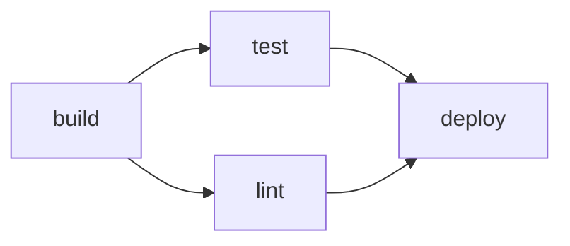

```yaml
jobs:
  build: { ... }
  test:   { needs: build }          # single dependency
  lint:   { needs: build }          # runs in parallel with test
  deploy: { needs: [test, lint] }   # fan-in: waits for BOTH
```

**Rules worth memorising:**

- A failed dependency makes downstream jobs **skipped** (grey), not failed — override with `always()` (section 8).
- You get the `needs` context: `needs.<job>.result` and `needs.<job>.outputs.<name>`.
- Cycles are rejected before the workflow runs.

**What to observe:** `deploy` sits idle until both `test` and `lint` are green. Then add `exit 1` to `lint`, re-run, and watch `deploy` turn **grey rather than red**.

---

## 7 — `if` — conditional jobs and steps

### ▶️ [`18-if-conditionals.yml`](workflows/18-if-conditionals.yml)

`if:` sits on a **job** or a **step**. False → skipped, and skipped is not failed.

```yaml
if: github.event_name == 'push' && github.ref == 'refs/heads/main'
```

Operators: `==` `!=` `&&` `||` `!`, plus `contains()`, `startsWith()`, `endsWith()`.

> ⚠️ **The gotcha that costs everyone an hour.** `if:` is *already* an expression context, so `${{ }}` is optional — but quoting is not harmless:
>
> | You write | GitHub sees |
> |---|---|
> | `if: ${{ false }}` | false ✅ |
> | `if: false` | false ✅ |
> | `if: 'false'` | **TRUE** — a non-empty string, and every non-empty string is truthy ❌ |
>
> Write conditions **without** `${{ }}` and **never quote booleans**.

**What to observe:** run it manually, then push to `main`, and compare which jobs are grey in each run.

---

## 8 — Status functions

### ▶️ [`19-status-functions.yml`](workflows/19-status-functions.yml)

Four functions let a job react to what happened before it:

| Function | True when |
|---|---|
| `success()` | nothing so far failed — **the invisible default** |
| `failure()` | something upstream failed |
| `cancelled()` | the run was cancelled |
| `always()` | always, including cancellation |

**The rule that explains all the confusing behaviour:**

> Every job and step has an invisible `if: success()` on it. That's why a job whose `needs` failed turns grey. The moment you write a status function yourself, that default is **removed** and your expression alone decides.

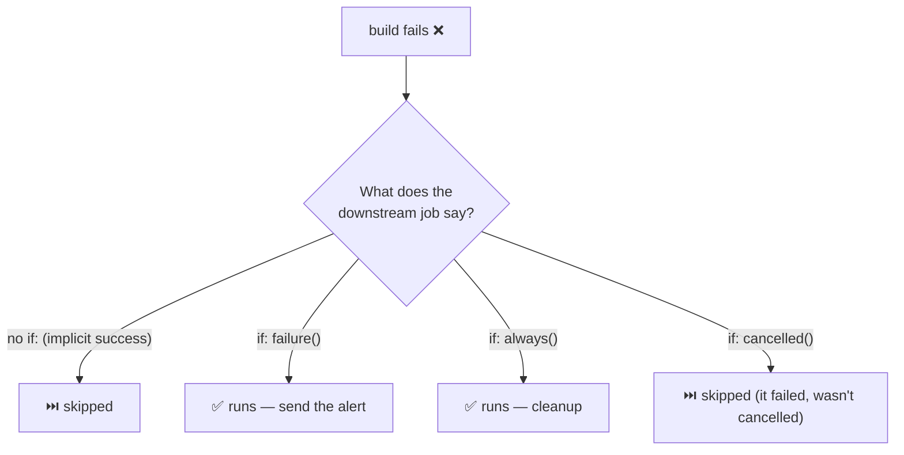

**Where you actually use this:** Slack alerts, uploading logs from a failed run, and teardown jobs that must destroy infrastructure even when the deploy exploded.

**What to observe:** `build` fails on purpose — see which of the four reporter jobs are green and which are grey.

---

## 9 — Job outputs — passing data between jobs

### ▶️ [`20-job-outputs.yml`](workflows/20-job-outputs.yml)

Different machines, so a small value has to be handed over explicitly. **Three links in a chain** — and missing the middle one is the classic bug.

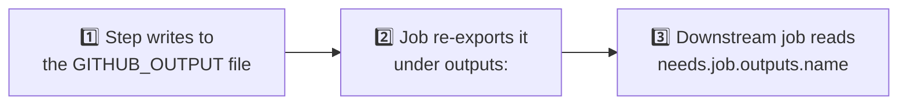

```yaml
jobs:
  produce:
    outputs:                                        # ← 2️⃣ skip this and you get ""
      version: ${{ steps.meta.outputs.version }}
    steps:
      - id: meta                                    # ← the id is mandatory
        run: echo "version=1.4.2" >> "$GITHUB_OUTPUT"   # ← 1️⃣

  consume:
    needs: produce
    steps:
      - run: echo "${{ needs.produce.outputs.version }}"  # ← 3️⃣
```

**Things that will catch you:**

- `::set-output::` is **dead** — disabled in 2023. Use `$GITHUB_OUTPUT`.
- Outputs are always **strings**. `"true"` is a string, not a boolean.
- **Multi-line** values need a delimiter (`key<<EOF … EOF`), or the value is silently truncated.
- Outputs containing a **secret are redacted** and arrive empty. Don't smuggle credentials this way.

---

# Part B — Doing more with less

## 10 — Matrix builds

### ▶️ [`21-matrix-basics.yml`](workflows/21-matrix-basics.yml) · [`22-matrix-multi-dimension.yml`](workflows/22-matrix-multi-dimension.yml) · [`23-matrix-fail-fast-max-parallel.yml`](workflows/23-matrix-fail-fast-max-parallel.yml)

"Does it work on Node 20, 22 **and** 24?" Write the job once; GitHub expands it.

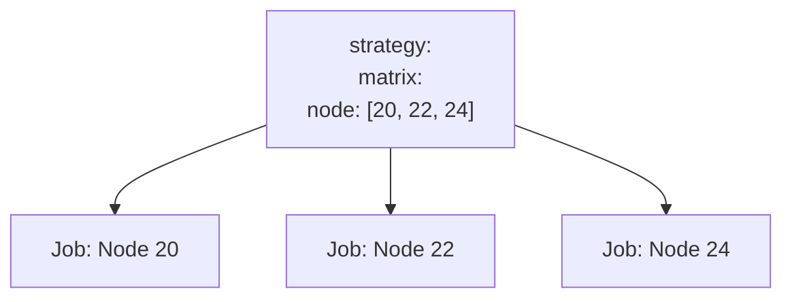

Two keys multiply — it's a **Cartesian product**:

```yaml
os:   [ubuntu-latest, windows-latest, macos-latest]   # 3
node: [20, 22, 24]                                    # 3
#                                                     → 9 jobs
```

### Trimming the grid

| Key | Behaviour |
|---|---|
| `exclude` | removes specific combinations |
| `include` | **two behaviours** — if it matches an existing combination it *adds a variable* to that job; if it matches nothing it *appends a new job* |

`exclude` is applied **first**, then `include` — so `include` can add back something you just excluded.

### Controlling the run

| Key | Default | Use it when |
|---|---|---|
| `fail-fast` | `true` | `false` while debugging — otherwise one red row cancels the others and you never learn whether the rest also broke |
| `max-parallel` | unlimited | jobs share a limited resource: one test DB, a rate-limited API, a small self-hosted pool |

> 💡 **Always template the job `name:` with the matrix values** — `name: Test on Node ${{ matrix.node }}`. Otherwise the Actions tab shows three identical rows and you can't tell which one failed.

> **Limit:** 256 jobs per matrix, per run.

**What to observe:** in file 23, `fail-fast: false` lets all four rows finish so you can see only Node 18 is red. Flip it to `true`, re-run, and watch the others get cancelled mid-flight.

---

## 11 — Caching

### ▶️ [`24-cache-dependencies.yml`](workflows/24-cache-dependencies.yml)

Every job starts blank, so `npm ci` re-downloads everything, every push, forever. A cache saves a directory at the end of a run and restores it at the start of the next.

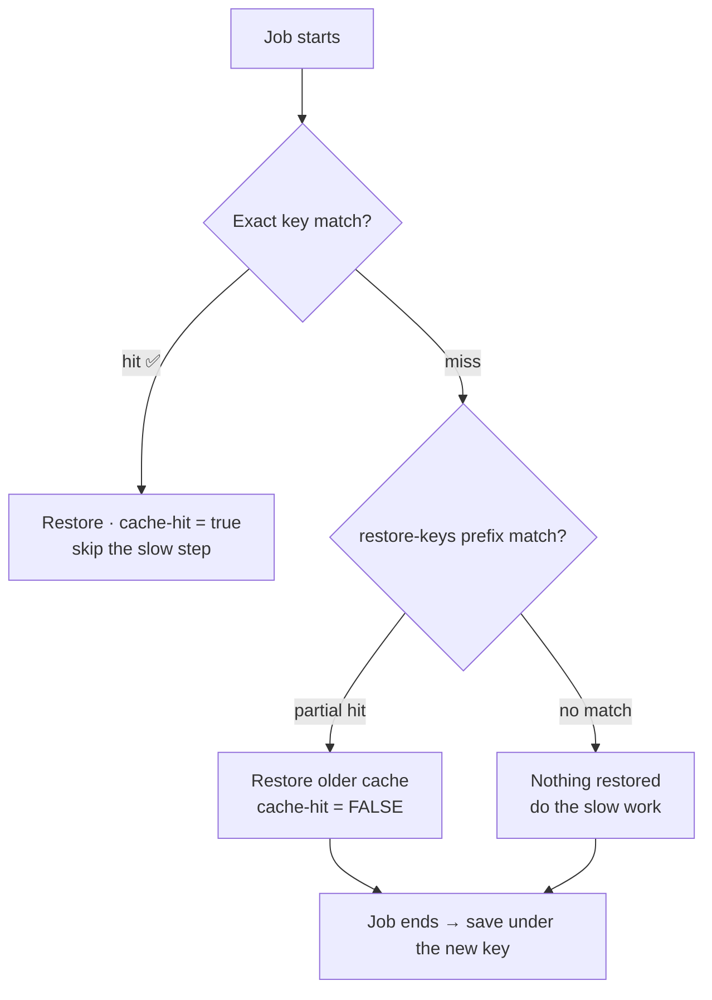

```yaml
- uses: actions/cache@v4
  with:
    path: ~/.npm
    key: ${{ runner.os }}-npm-${{ hashFiles('**/package-lock.json') }}
    restore-keys: |
      ${{ runner.os }}-npm-
```

**The key is the whole concept.** `hashFiles()` returns a SHA of the matched files, so the key changes the instant a dependency changes — that's what makes the cache self-invalidating.

> ⚠️ **Caches are immutable.** You cannot overwrite an existing key. A key like `npm-cache` with no hash gets written once and then **never updates again**, no matter how much `package.json` changes. That is the classic caching bug.

> ⚠️ `cache-hit` is `'true'` only on an **exact** key match. A `restore-keys` partial hit leaves it `false`.

**Easy mode:** `setup-node` has caching built in — `cache: 'npm'` and it hashes the lockfile for you. Reach for that first; use `actions/cache` when you need to cache something else.

### Cache vs artifact — the distinction people get wrong

| | **Cache** | **Artifact** |
|---|---|---|
| Purpose | speed | the result |
| If you delete it | build is slower | work is lost |
| Content | reproducible (`~/.npm`, `node_modules`) | produced (`dist/`, reports) |
| Scoped to | branch + default branch | one workflow run |
| Say it as | *"I could rebuild this, I just don't want to wait"* | *"This **is** the output"* |

**Limits:** 10 GB per repo (LRU eviction), and anything untouched for 7 days is deleted. A branch can read its own caches and the **default branch's** caches — never a sibling branch's.

**What to observe:** run the workflow **twice**. First run says "Cache not found"; second says "Cache restored from key" and skips the slow step.

---

## 12 — Artifacts (v4)

### ▶️ [`25-artifacts-basics.yml`](workflows/25-artifacts-basics.yml) · [`26-artifacts-matrix-and-merge.yml`](workflows/26-artifacts-matrix-and-merge.yml)

Artifacts move **files** between jobs, and out of CI to a human.

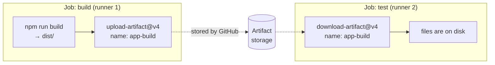

```yaml
- uses: actions/upload-artifact@v4
  with:
    name: app-build
    path: sample-app/dist/     # ⚠️ repo-root relative — working-directory does NOT apply
    retention-days: 7          # default 90
    if-no-files-found: error   # default 'warn' hides a broken build
```

> ⚠️ **Use v4.** The v3 artifact actions were **fully retired on 30 January 2025** and now fail outright. Any tutorial older than that is broken — check the version before you copy.

### What v4 changed, and the trap it creates

- Artifacts are **immutable** — a name can be written **once per run**.
- Names must be **unique** within a run.
- Uploads/downloads are much faster, and an artifact appears in the UI as soon as its job finishes.

**The trap:** put an upload inside a **matrix** and every row uses the same name. Row 1 succeeds; rows 2 and 3 fail with `Conflict: an artifact with this name already exists on the workflow run`. Under v3 the files quietly merged — which is why migrated workflows break here.

**The fix — include the matrix values in the name:**

```yaml
name: report-node-${{ matrix.node }}    # unique per row
```

**Then merge them back**, two ways:

| Approach | Use when |
|---|---|
| `actions/upload-artifact/merge@v4` with `pattern: report-*` | a **human** will download one zip |
| `download-artifact@v4` with `pattern:` + `merge-multiple: true` | a **later job** needs them all on one runner |

💡 File 26 also shows **`$GITHUB_STEP_SUMMARY`** — echo markdown into it and it renders on the run's summary page. Genuinely underused for surfacing test results without making anyone open the logs.

---

# Part C — Reuse

## 13 — Reuse: reusable workflows vs composite actions

### ▶️ [`27-reusable-workflow-callee.yml`](workflows/27-reusable-workflow-callee.yml) · [`28-reusable-workflow-caller.yml`](workflows/28-reusable-workflow-caller.yml) · [`29-composite-action-demo.yml`](workflows/29-composite-action-demo.yml) · [`actions/node-ci-setup/action.yml`](actions/node-ci-setup/action.yml)

Copy-pasting the same twenty lines of CI into eight repos is how CI rots. There are three ways to stop, and picking the right one is today's most-asked interview question.

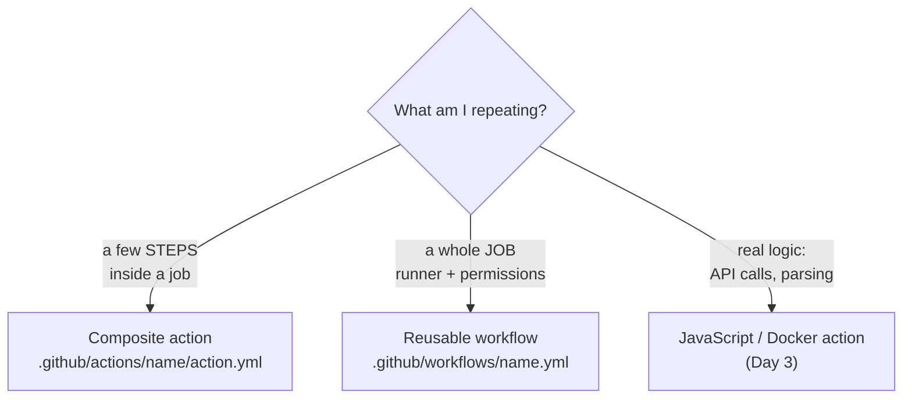

### Reusable workflows — reuse whole **jobs**

The `workflow_call` trigger turns a workflow into something other workflows invoke like a function, with a **typed interface**:

```yaml
# callee
on:
  workflow_call:
    inputs:
      node-version: { type: string, default: '20', required: false }
      run-lint:     { type: boolean, default: true }
    secrets:
      API_KEY: { required: false }
    outputs:
      tested-version: { value: "${{ jobs.run-tests.outputs.node-version }}" }
```

```yaml
# caller — note this is at JOB level, not step level
jobs:
  test:
    uses: ./.github/workflows/27-reusable-workflow-callee.yml
    with:
      node-version: '22'
    secrets:
      API_KEY: ${{ secrets.MY_API_KEY }}
```

> 🔑 **A job with `uses:` must not have `steps:` or `runs-on:`.** The called workflow brings its own. The only keys allowed alongside it are `with`, `secrets`, `needs`, `if`, `permissions`, `strategy`, `concurrency`. Trying to bolt "just one more step" onto the call is the mistake everyone makes once.

**Referencing one:**

```
./.github/workflows/file.yml                 same repo, current commit
owner/repo/.github/workflows/file.yml@v1     another repo, at a tag
owner/repo/.github/workflows/file.yml@<sha>  pinned to a commit (Day 3)
```

**Limits:** nesting depth 4; at most 20 unique reusable workflows per caller; `env` from the caller does **not** reach the callee — pass it as an input.

💡 File 28 shows a **matrix of reusable-workflow calls** — `strategy` is allowed next to `uses`, and that's where reuse really pays off.

### Composite actions — reuse **steps**

```yaml
runs:
  using: composite          # not node20 — that's a JavaScript action
  steps:
    - uses: actions/setup-node@v6
      with: { node-version: '${{ inputs.node-version }}' }
    - shell: bash           # ← MANDATORY on every run step
      run: npm ci
```

Used from a workflow as a single step:

```yaml
- uses: actions/checkout@v5              # ⚠️ MUST come first
- uses: ./.github/actions/node-ci-setup
  with: { node-version: '22' }
```

> ⚠️ **The chicken-and-egg rule.** A local action is just a file in your repo, so it doesn't exist on the runner until `actions/checkout` has run. Forget it and you get `Can't find 'action.yml' under '.../.github/actions/...'`. That's also why the action itself must **not** check out — by the time it starts, the code is already there.

> ⚠️ Every `run:` step in a composite action **must** declare `shell:`. There's no default. Omitting it gives `Required property is missing: shell`.

### The decision table

| | Composite action | Reusable workflow |
|---|---|---|
| Unit of reuse | a few **steps** | whole **jobs** |
| Called from | a **step** | a **job** |
| Picks the runner? | no — inherits | yes — brings its own |
| Own `permissions:`? | no | yes |
| Can run a matrix? | no | yes |
| Lives in | **any** folder | `.github/workflows/` **only** |
| Sees `secrets`? | no — pass as inputs | yes — declared explicitly |

---

# Part D — Security & control

## 14 — `GITHUB_TOKEN` and least-privilege permissions

### ▶️ [`30-token-permissions.yml`](workflows/30-token-permissions.yml)

Every run gets a token it never asked for. GitHub mints a fresh `GITHUB_TOKEN`, injects it as `secrets.GITHUB_TOKEN`, and destroys it when the run ends. You use it to talk to the GitHub API as the repo itself.

**The problem:** by default that token may be allowed to **write**. Any third-party action running in your job inherits it and can push commits, publish packages, or open PRs as you. That is the exact mechanism behind the supply-chain attacks we dissect on Day 3.

```yaml
permissions:          # workflow level: the default for every job
  contents: read

jobs:
  publish:
    permissions:      # job level: overrides the workflow
      contents: read
      packages: write
```

> 🔑 **The rule that makes this safe:** specifying `permissions:` **at all** sets every scope you did not list to `none`. It is **not additive**. A two-line block is already least-privilege — you don't have to enumerate the other fifteen.

| Shorthand | Meaning |
|---|---|
| `permissions: read-all` | every scope read — fine for most CI |
| `permissions: write-all` | every scope write — avoid |
| `permissions: {}` | nothing at all — for pure compute jobs |

**Check your repo's default:** `Settings → Actions → General → Workflow permissions`. Newer repos default to read-only; older ones may still be read/write. Never rely on it — declare it in the file.

**What to observe:** expand **"Set up job"** in each job's log. GitHub prints the exact scopes it granted. Compare them job by job.

---

## 15 — Environments, deployment gates & approvals

### ▶️ [`31-environments-and-approvals.yml`](workflows/31-environments-and-approvals.yml)

An **environment** is a named deployment target — `staging`, `production`. It gives a job three things it can't otherwise have:

1. Its own **secrets and variables**, scoped to that target.
2. **Protection rules** — required reviewers, wait timers, branch policies.
3. **Deployment history** on the repo's Environments page.

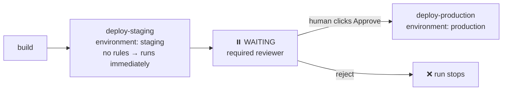

```yaml
deploy-production:
  environment:
    name: production
    url: ${{ vars.API_URL }}     # clickable link on the run page
```

> 🔑 **The `environment:` key is the entire gate.** There is no approval step to write in YAML — the required reviewer configured in repo settings is what pauses the run.

### Secret precedence — most specific wins

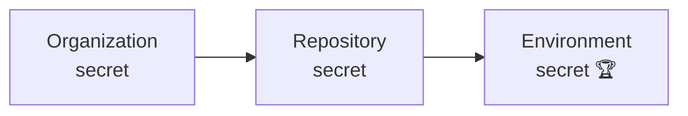

Both environments define `DEPLOY_TOKEN` under the **same name**; the job that says `environment: staging` transparently gets the staging value. That's the whole trick — one workflow, one secret name, different values per target, and no `if` statements picking secret names.

### 📋 Setup before running file 31

`Settings → Environments → New environment`:

| Environment | Secret | Variable | Protection rules |
|---|---|---|---|
| `staging` | `DEPLOY_TOKEN` = `staging-token-123` | `API_URL` = `https://staging.example.com` | none |
| `production` | `DEPLOY_TOKEN` = `prod-token-456` | `API_URL` = `https://api.example.com` | ✅ Required reviewers → **yourself**<br/>✅ Wait timer → 1 min<br/>✅ Deployment branches → `main` |

> 💡 **Branch policies are enforced by GitHub, not by your `if:` conditions** — which is exactly why they can't be bypassed by editing the workflow file.

**What to observe:** the run pauses at `deploy-production` with a yellow **Waiting** badge and a **Review deployments** button. Nothing executes until you approve.

---

## 16 — Concurrency

### ▶️ [`32-concurrency.yml`](workflows/32-concurrency.yml)

Two problems that pull in **opposite directions**:

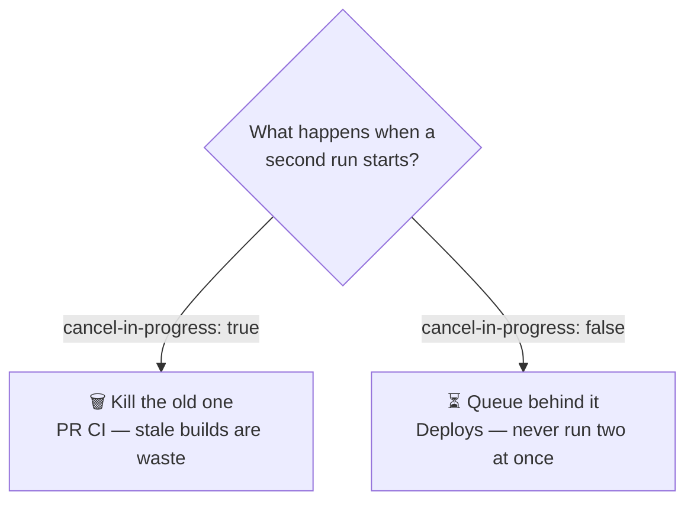

```yaml
concurrency:
  group: ${{ github.workflow }}-${{ github.ref }}
  cancel-in-progress: true
```

**Choosing the group key is the whole design decision:**

| Group | Effect |
|---|---|
| `${{ github.workflow }}-${{ github.ref }}` | one run per workflow **per branch** — typical CI |
| `production-deploy` | one run **globally** — deploys never overlap |
| `deploy-${{ inputs.environment }}` | one per target |

Leaving `github.ref` **out** of a deploy group is deliberate: you want *all* deploys serialised, not one per branch.

> ⚠️ **The queue is one deep.** Per group there can be one running and one pending run. Queue a third and it **replaces** the pending one, which is cancelled. Concurrency is not a durable job queue — don't use it as one.

💡 Expressions work inside the block, so you can cancel only on PRs:

```yaml
cancel-in-progress: ${{ github.event_name == 'pull_request' }}
```

> 🔑 Never `cancel-in-progress: true` on a deploy. Killing a half-finished deploy leaves production in an unknown state — far worse than waiting.

---

## 17 — Timeouts & `continue-on-error`

### ▶️ [`33-timeout-and-continue-on-error.yml`](workflows/33-timeout-and-continue-on-error.yml)

**A job's default timeout is 360 minutes. Six hours.** A hung test or a command silently waiting for input will happily burn all six hours of billed runner time before anyone notices.

```yaml
jobs:
  build:
    timeout-minutes: 10        # ← put this on every job you write
    steps:
      - timeout-minutes: 2     # tighter limit for one step
        run: ...
```

Set it to roughly 2–3× the normal runtime. Too tight and you cancel your own healthy builds on a slow day.

**`continue-on-error`** is for genuinely optional work — an experimental matrix row, a flaky third-party coverage upload. It is **not** for silencing a test that keeps failing; that's how a green pipeline stops meaning anything.

> 🔑 **`outcome` vs `conclusion`** — the distinction that makes this usable:
>
> | | Value |
> |---|---|
> | `steps.<id>.outcome` | what **actually** happened → `failure` |
> | `steps.<id>.conclusion` | what was **reported** after `continue-on-error` → `success` |
>
> To react to a real failure you must check **`outcome`**. Checking `conclusion` silently never matches, and people lose an afternoon to it.

At **job** level, `continue-on-error` pairs naturally with a matrix — let the experimental row fail without turning the whole run red.

---

# Part E

## 18 — 🚀 Capstone — a full build → test → deploy pipeline

### ▶️ [`34-pipeline-capstone.yml`](workflows/34-pipeline-capstone.yml)

Everything from today in one file a working team would actually ship.

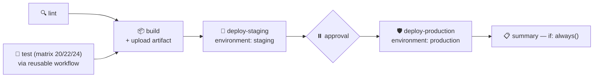

### 📋 Setup

Copy into your practice repo:

```text
your-repo/
├── .github/
│   └── workflows/
│       ├── 34-pipeline-capstone.yml
│       └── 27-reusable-workflow-callee.yml   ← the capstone CALLS this
└── sample-app/
```

Plus the `staging` and `production` environments from section 15.

### What each piece demonstrates

| Line in the capstone | Concept | Section |
|---|---|---|
| `permissions: contents: read` | least privilege | 14 |
| `concurrency:` with `cancel-in-progress:` expression | cancel stale PR runs, protect main | 16 |
| `needs: [lint, test]` | fan-in | 6 |
| `uses: ./.github/workflows/27-...` with `strategy.matrix` | reusable workflow × matrix | 10, 13 |
| `cache: 'npm'` | caching | 11 |
| `outputs: version:` → `needs.build.outputs.version` | job outputs | 9 |
| `upload-artifact` / `download-artifact` | artifacts | 12 |
| `if: github.event_name != 'pull_request'` | conditional deploy | 7 |
| `environment: production` | approval gate | 15 |
| `if: always()` + `contains(needs.*.result, 'failure')` | reporting | 8 |
| `timeout-minutes:` on every job | cost control | 17 |

> 🔑 **Build once, deploy the same bytes everywhere.** Staging and production both download the *same* artifact rather than rebuilding. Rebuilding per environment means they aren't actually the same code — the classic *"but it worked in staging"* bug.

> 🔑 **`if: always()` giveth, and you must taketh away.** The `summary` job succeeds on its own, so without the final `contains(needs.*.result, 'failure')` check the workflow would look **green even when build failed**.

### Try these

1. Break a test → watch `build`, both deploys and the approval all skip, and `summary` still report.
2. Open a PR → lint, test and build run; **both deploys are skipped**.
3. Merge to main → staging deploys, then production **waits for you**.
4. Push twice quickly to a PR branch → the first run is **cancelled** by concurrency.

---

## 🧾 Day 2 cheat sheet

```yaml
permissions:                       # least privilege, workflow-wide
  contents: read

concurrency:                       # cancel stale runs
  group: ${{ github.workflow }}-${{ github.ref }}
  cancel-in-progress: true

jobs:
  build:
    runs-on: ubuntu-latest
    timeout-minutes: 10            # never rely on the 360-minute default
    outputs:
      version: ${{ steps.m.outputs.version }}
    strategy:
      fail-fast: false
      max-parallel: 2
      matrix:
        node: [20, 22, 24]
        exclude: [{ node: 20 }]
        include: [{ node: 18, label: legacy }]
    steps:
      - uses: actions/checkout@v5
      - uses: actions/setup-node@v6
        with:
          node-version: ${{ matrix.node }}
          cache: 'npm'
      - id: m
        run: echo "version=1.0.$GITHUB_RUN_NUMBER" >> "$GITHUB_OUTPUT"
      - uses: actions/upload-artifact@v4
        with:
          name: build-${{ matrix.node }}     # UNIQUE per matrix row
          path: dist/

  deploy:
    needs: build
    if: github.ref == 'refs/heads/main'
    environment:
      name: production               # ← the approval gate
      url: ${{ vars.API_URL }}
    runs-on: ubuntu-latest
    steps:
      - uses: actions/download-artifact@v4
        with: { name: build-20 }
      - run: echo "${{ needs.build.outputs.version }}"

  notify:
    needs: [build, deploy]
    if: always()
    runs-on: ubuntu-latest
    steps:
      - run: echo "${{ needs.build.result }}"
```

| I want to… | Use |
|---|---|
| Make jobs run in order | `needs:` |
| Run a job only on main | `if: github.ref == 'refs/heads/main'` |
| Run cleanup even on failure | `if: always()` |
| Alert only on failure | `if: failure()` |
| Pass a **value** between jobs | `$GITHUB_OUTPUT` → `outputs:` → `needs.x.outputs.y` |
| Pass a **file** between jobs | `upload-artifact@v4` / `download-artifact@v4` |
| Test many versions | `strategy.matrix` |
| See all matrix failures | `fail-fast: false` |
| Speed up installs | `cache: 'npm'` or `actions/cache@v4` |
| Stop copy-pasting **steps** | composite action |
| Stop copy-pasting a **job** | reusable workflow (`on: workflow_call`) |
| Lock down the token | `permissions: { contents: read }` |
| Require a human before prod | `environment: production` + required reviewers |
| Kill stale PR builds | `concurrency` + `cancel-in-progress: true` |
| Stop a hung job burning 6 hours | `timeout-minutes:` |

---

## 🔗 Reference links

**Official documentation**

- [Using jobs — `needs`, `if`, outputs](https://docs.github.com/en/actions/using-jobs/using-jobs-in-a-workflow)
- [Running variations of jobs in a workflow (matrix)](https://docs.github.com/en/actions/using-jobs/using-a-matrix-for-your-jobs)
- [Caching dependencies to speed up workflows](https://docs.github.com/en/actions/using-workflows/caching-dependencies-to-speed-up-workflows)
- [Storing and sharing data from a workflow (artifacts)](https://docs.github.com/en/actions/using-workflows/storing-workflow-data-as-artifacts)
- [Reusing workflows](https://docs.github.com/en/actions/using-workflows/reusing-workflows)
- [Creating a composite action](https://docs.github.com/en/actions/creating-actions/creating-a-composite-action)
- [Assigning permissions to jobs (`GITHUB_TOKEN`)](https://docs.github.com/en/actions/using-jobs/assigning-permissions-to-jobs)
- [Using environments for deployment](https://docs.github.com/en/actions/deployment/targeting-different-environments/using-environments-for-deployment)
- [Control concurrency of workflows and jobs](https://docs.github.com/en/actions/using-jobs/using-concurrency)
- [Contexts](https://docs.github.com/en/actions/learn-github-actions/contexts) · [Expressions](https://docs.github.com/en/actions/learn-github-actions/expressions)
- [Workflow syntax reference](https://docs.github.com/en/actions/using-workflows/workflow-syntax-for-github-actions)

**Actions used today**

- [`actions/cache`](https://github.com/actions/cache) · [`actions/upload-artifact`](https://github.com/actions/upload-artifact) · [`actions/download-artifact`](https://github.com/actions/download-artifact)

**Migration note**

- [Deprecation of v3 artifact actions](https://github.blog/changelog/2024-04-16-deprecation-notice-v3-of-the-artifact-actions/) — v3 fully retired 30 January 2025.

---

## ⏭️ What's next — Day 3 (Advanced)

Tomorrow we harden all of this the way production teams do:

- **Supply-chain security** — pinning actions to a **commit SHA** (and the 2025 `tj-actions/changed-files` compromise that made everyone start), immutable actions, and org-level pinning policies
- **OIDC** — authenticating to AWS/Azure/GCP with **short-lived tokens and no stored cloud secrets**
- **Custom actions** — building and publishing your own **JavaScript** and **Docker** actions
- **Advanced triggers** — `workflow_run`, `repository_dispatch`, and monorepo change detection
- **Self-hosted runners** and modern scaling
- **Publishing to GHCR**, CodeQL, secret scanning, and debugging with `act`

See you on Day 3! 🚀
